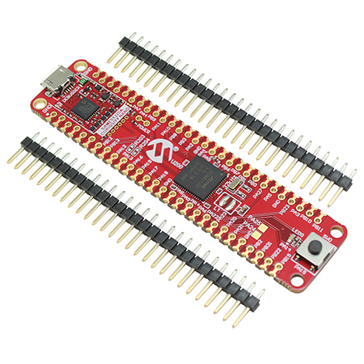
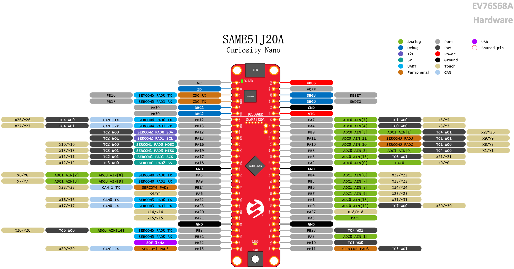

.. _atsame51_cnano:

SAM E51 Curiosity Nano Evaluation Kit
#####################################

Overview
********

The SAM E51 Curiosity Nano Evaluation Kit is a hardware 
platform to evaluate the SAME51J20A microcontroller (MCU). 
The evaluation kit provides easy access to the features of 
the SAM E51 MCU to integrate the device into a custom design. 
Because the evaluation kit contains an On-Board Nano Debugger 
for programming and debugging, no external tools are necessary 
to program the SAME51J20A device.

Hardware
********

- ATSAME51J20A ARM Cortex-M4F processor at up to 120 MHz
- 32.768 kHz crystal oscillator
- 1024 KiB flash memory and 256 KiB of RAM
- One yellow user LED
- One mechanical user push button
- On-board USB based EDBG unit with serial console

Supported Features
==================

The atsame51_cnano board configuration supports the following hardware
features:

..
   +---------------+------------+----------------------------+
   | Interface     | Controller | Driver/Component           |
   +===============+============+============================+
   | ADC           | on-chip    | adc                        |
   +---------------+------------+----------------------------+
   | DAC           | on-chip    | dac                        |
   +---------------+------------+----------------------------+
   | DMAC          | on-chip    | dma                        |
   +---------------+------------+----------------------------+
   | EEPROM        | i2c        | eeprom, EUI-48 MAC Address |
   +---------------+------------+----------------------------+
   | EIC           | on-chip    | interrupt_controller       |
   +---------------+------------+----------------------------+
   | GMAC          | on-chip    | ethernet, mdio             |
   +---------------+------------+----------------------------+
   | GPIO          | on-chip    | gpio                       |
   +---------------+------------+----------------------------+
   | MPU           | on-chip    | arch/arm                   |
   +---------------+------------+----------------------------+
   | NVIC          | on-chip    | arch/arm                   |
   +---------------+------------+----------------------------+
   | NVMCTRL       | on-chip    | flash                      |
   +---------------+------------+----------------------------+
   | PORT          | on-chip    | pinctrl                    |
   +---------------+------------+----------------------------+
   | RTC           | on-chip    | timer                      |
   +---------------+------------+----------------------------+
   | SERCOM I2C    | on-chip    | i2c                        |
   +---------------+------------+----------------------------+
   | SERCOM SPI    | on-chip    | spi                        |
   +---------------+------------+----------------------------+
   | SERCOM USART  | on-chip    | serial, console            |
   +---------------+------------+----------------------------+
   | Serial Number | on-chip    | hwinfo                     |
   +---------------+------------+----------------------------+
   | SYSTICK       | on-chip    | timer                      |
   +---------------+------------+----------------------------+
   | TC            | on-chip    | counter                    |
   +---------------+------------+----------------------------+
   | TCC           | on-chip    | counter, pwm               |
   +---------------+------------+----------------------------+
   | TRNG          | on-chip    | entropy                    |
   +---------------+------------+----------------------------+
   | USB           | on-chip    | usb                        |
   +---------------+------------+----------------------------+
   | WDT           | on-chip    | watchdog                   |
   +---------------+------------+----------------------------+

   Other hardware features are not currently supported by Zephyr.

The default configuration can be found in the Kconfig
``boards/arm/atsame51_cnano/atsame51_cnano_defconfig``.

Pin Mapping
===========

The SAM E51 Curiosity Nano evaluation kit has 4 GPIO controllers. These
controllers are responsible for pin muxing, input/output, pull-up, etc.

For more details please refer to `SAM D5x/E5x Family Datasheet`_ and the 
`SAM E51 Curiosity Nano User Guide`_.

..
   Default Zephyr Peripheral Mapping:
   ----------------------------------
   - SERCOM2 USART TX : PB24
   - SERCOM2 USART RX : PB25
   - GPIO/PWM LED0    : PC18
   - GPIO SW0         : PB31
   - GMAC RMII REFCK  : PA14
   - GMAC RMII TXEN   : PA17
   - GMAC RMII TXD0   : PA18
   - GMAC RMII TXD1   : PA19
   - GMAC RMII CRSDV  : PC20
   - GMAC RMII RXD0   : PA13
   - GMAC RMII RXD1   : PA12
   - GMAC RMII RXER   : PA15
   - GMAC MDIO MDC    : PC11
   - GMAC MDIO MDIO   : PC12
   - SERCOM4 SPI SCK  : PB26
   - SERCOM4 SPI MOSI : PB27
   - SERCOM4 SPI MISO : PB29
   - SERCOM7 I2C SDA  : PD08
   - SERCOM7 I2C SCL  : PD09
   - USB DP           : PA25
   - USB DM           : PA24

System Clock
============

The SAME54 MCU is configured to use the 32.768 kHz external oscillator
with the on-chip PLL generating the 48 MHz system clock.

Serial Port
===========

..
   The SAME54 MCU has 8 SERCOM based USARTs with one configured as USARTs in
   this BSP. SERCOM2 is the default Zephyr console.

   - SERCOM2 115200 8n1 connected to the onboard Atmel Embedded Debugger (EDBG)

PWM
===

..
   The SAME54 MCU has 5 TCC based PWM units with up to 6 outputs each and a period
   of 24 bits or 16 bits.  If :code:`CONFIG_PWM_SAM0_TCC` is enabled then LED0 is
   driven by TCC0 instead of by GPIO.

SPI Port
========

..
   The SAME54 MCU has 8 SERCOM based SPIs.

I2C Port
========

..
   The SAME54 MCU has 8 SERCOM based I2Cs. On the SAM E54 Xplained Pro,
   SERCOM7 is connected to a AT24MAC402 EEPROM and a ATECC508A Crypto
   Authentication device.

Programming and Debugging
*************************

The SAM E51 Curiosity Nano comes with a Atmel Embedded Debugger (EDBG).  This
provides a debug interface to the SAME51 chip and is supported by
OpenOCD.

Flashing
========

#. Build the Zephyr kernel and the ``hello_world`` sample application:

   .. zephyr-app-commands::
      :zephyr-app: samples/hello_world
      :board: atsame51_cnano
      :goals: build
      :compact:

#. Connect the SAM E51 Curiosity Nano to your host computer using the USB debug
   port.

#. Run your favorite terminal program to listen for output. Under Linux the
   terminal should be :code:`/dev/ttyACM0`. For example:

   .. code-block:: console

      $ minicom -D /dev/ttyACM0 -o

   The -o option tells minicom not to send the modem initialization
   string. Connection should be configured as follows:

   - Speed: 115200
   - Data: 8 bits
   - Parity: None
   - Stop bits: 1

#. To flash an image:

   .. zephyr-app-commands::
      :zephyr-app: samples/hello_world
      :board: atsame51_cnano
      :goals: flash
      :compact:

   You should see "Hello World! atsame51_cnano" in your terminal.

References
**********

.. target-notes::

.. _Microchip website:
    https://www.microchip.com/en-us/product/ATSAME51J20A

.. _SAM D5x/E5x Family Datasheet:
    https://ww1.microchip.com/downloads/aemDocuments/documents/MCU32/ProductDocuments/DataSheets/SAM-D5x-E5x-Family-Data-Sheet-DS60001507.pdf

.. _SAM E51 Curiosity Nano User Guide:
    https://ww1.microchip.com/downloads/aemDocuments/documents/MCU32/ProductDocuments/UserGuides/SAM-E51-Curiosity-Nano-User-Guide-DS70005432.pdf
